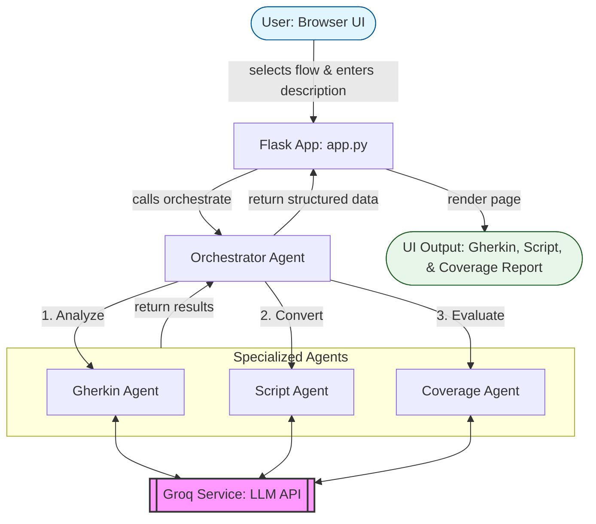

# TestPilot AI

## Project Name
TestPilot AI

## Problem Statement
Manual Quality Assurance processes are inherently time-consuming, repetitive, and prone to human error. Developing comprehensive test cases, authoring reliable automation scripts, and performing deep coverage analysis requires significant specialized effort and often results in a lack of traceability between requirements and test artifacts. Furthermore, the risk of overlooking critical edge cases in complex banking flows can lead to costly late-stage defect discovery. There is an urgent need for an AI-driven solution that automates the end-to-end QA lifecycle, ensuring high-assurance testing with minimal manual intervention.

## Team Members
- **Aswathy K C**
- **Rohitha P K**
- **Soorya M S**

## Project Overview
The TestPilot AI assistant uses a multi-agent orchestration pattern to:
1. **Identify Scenarios**: Generate Gherkin/BDD scenarios with mandatory positive, negative, and edge-case coverage.
2. **Automate Execution**: Produce ready-to-run Playwright Python scripts configured for the Microsoft Edge browser.
3. **Analyze Gaps**: Perform a 5-step coverage analysis to detect missing flows and high-risk areas.

## Features
- **Multi-Agent Orchestration**: Specialized agents for Gherkin design, script generation, and coverage evaluation.
- **Strict Mapping Logic**: 1:1 traceability between BDD scenarios and automation code.
- **Modern Tech Stack**: Built with Python 3.11+, Flask, and the Groq (Llama 3.3) LLM API.
- **Robust Reliability**: Intelligent fallback logic handles API quota limits and incomplete outputs gracefully.
- **Aesthetic UI**: Clean, responsive web interface for rapid interaction and analysis.

## Tech Stack
- **Python**: 3.11+
- **Flask**: 2.3.x
- **Playwright (Python)**: 1.40.x (Latest stable)
- **Groq API**: llama-3.3-70b-versatile
- **pytest**: 7.4.x
- **python-dotenv**: 1.0.x

## Project Structure

```text
AGENTIC_QA_PARABANK/
├── docs/                   # System architecture and design docs
│   └── architecture.md
├── src/                    # Core source code
│   ├── agents/             # Multi-agent logic (Gherkin, Script, Coverage)
│   │   ├── coverage_agent.py
│   │   ├── gherkin_agent.py
│   │   ├── orchestrator.py
│   │   └── script_agent.py
│   ├── services/           # LLM integration service (Groq)
│   │   └── llm_service.py
│   ├── static/             # Frontend styling (CSS)
│   ├── templates/          # Web interface (HTML)
│   └── app.py              # Flask server and route handler
├── tests/                  # Automated testing suite (pytest)
│   ├── test_coverage_agent.py
│   ├── test_gherkin_agent.py
│   └── test_script_agent.py
├── .env                    # API keys and local config
├── .gitignore              # Git exclusion rules
├── README.md               # Main project documentation
└── requirements.txt        # Dependency manifest
```

## Architecture Overview
The system follows a decoupled, multi-agent architecture designed for scalability and reliability. The **OrchestratorAgent** serves as the central brain, delegating specific QA tasks to specialized sub-agents while the **LLMService** handles all communication with Groq, including intelligent continuation and fallback logic.

## How It Works (Step-by-Step)
1. **Selection**: User selects an application flow (e.g., Fund Transfer).
2. **Input**: User provides a feature description (e.g., "Transfer $100 between accounts").
3. **Orchestration**: The `OrchestratorAgent` coordinates the `GherkinAgent`, `ScriptAgent`, and `CoverageAgent`.
4. **AI Generation**: Agents communicate with **Groq** via the `LLMService` to produce structured content.
5. **Display**: Final artifacts are rendered in the dashboard for review and export.

## How to Run Locally

1. **Clone the repository** and navigate to the project root.
2. **Create a virtual environment**:
   ```powershell
   python -m venv .venv
   .\.venv\Scripts\Activate.ps1
   ```
3. **Install dependencies**:
   ```powershell
   pip install -r requirements.txt
   ```
4. **Configure Environment**:
   Create a `.env` file in the repository root and add your API credentials:
   ```text
   GROQ_API_KEY=your_actual_key_here
   GROQ_MODEL=llama-3.3-70b-versatile
   ```
5. **Run the Application**:
   ```powershell
   python src/app.py
   ```
6. **Open in Browser**:
   Navigate to `http://127.0.0.1:5000` to access the TestPilot AI dashboard.

## System Architecture Diagram


## Sample Input & Output

### 1. Input Section
- **Selected Flow**: Fund Transfer
- **Feature Description**: User wants to transfer $500.00 from their Savings account (ID: 13545) to their Checking account (ID: 14432). The system must validate that the balance in the Savings account is sufficient and ensure the transaction ID is generated upon success.

### 2. Gherkin Output
```gherkin
Feature: Fund Transfer

  # Positive Scenarios
  Scenario: Successful transfer between internal accounts
    Given the user has navigated to the "Transfer Funds" section in the sidebar
    When the user selects "13545" from the "From account #" dropdown
    And the user selects "14432" from the "To account #" dropdown
    And the user enters "500.00" into the "Amount" field
    And the user clicks the "Transfer" button
    Then the system should display "Transfer Complete!"
    And the transaction summary should show a new "Transaction ID"

  # Negative Scenarios
  Scenario: Transfer fails due to insufficient funds
    Given the "13545" account has a balance of "200.00"
    And the user is on the "Transfer Funds" page
    When the user enters "500.00" into the "Amount" field
    And the user clicks "Transfer"
    Then the application should display an error "The amount exceeds the current balance"

  # Field-Level Validations
  Scenario: Numeric validation for Amount field
    When the user enters "ABC" into the "Amount" field
    Then the "Transfer" button should be disabled or an error "Please enter a valid number" should appear
```

### 3. Playwright Output (Python)
```python
# Scenario Mapping: Successful transfer between internal accounts
def test_successful_fund_transfer(page):
    page.goto("https://parabank.parasoft.com/parabank/transfer.htm")
    
    # Perform Transfer
    page.get_by_label("From account").select_option("13545")
    page.get_by_label("To account").select_option("14432")
    page.locator("input[name='amount']").fill("500.00")
    page.get_by_role("button", name="Transfer").click()
    
    # Assert Success
    expect(page.locator("h1.title")).to_have_text("Transfer Complete!")
    expect(page.locator("#transactionId")).not_to_be_empty()
```

### 4. Coverage Output
- **Covered Scenarios**: 
    - Standard internal account-to-account transfer.
    - Real-time balance validation (Insufficient funds).
    - Basic field-level data type validation.
- **Missing Scenarios**: 
    - Transfer to the same source account (Self-transfer restriction).
    - Large amount boundary check (e.g., $1,000,000+).
    - Multiple rapid transfer attempts (Idempotency check).
- **Risk Areas**: 
    - High: Transaction state if the connection drops after the "Transfer" click.
    - Medium: Data consistency between the Transfer page and the Account Overview page.
- **Suggestions**: 
    - Implement a "Review & Confirm" overlay to prevent accidental transfers.
    - Add a "Transaction History" link directly on the success confirmation page.

## Screenshots


*Figure 1: Main Dashboard UI for feature input and flow selection.*


*Figure 2: Structured BDD scenarios with Positive, Negative, and Edge case groupings.*


*Figure 3: Executable Playwright Python script with 1:1 scenario mapping.*


*Figure 4: Detailed 5-section coverage analysis and risk assessment.*

## Demo Video

Watch the 5-minute demo here:
[TestPilot AI Demo - Loom](https://www.loom.com/share/9788076207844ab4a7c6e3d93609a3bf)

---
*Developed for Parabank Test Automation submission.*
