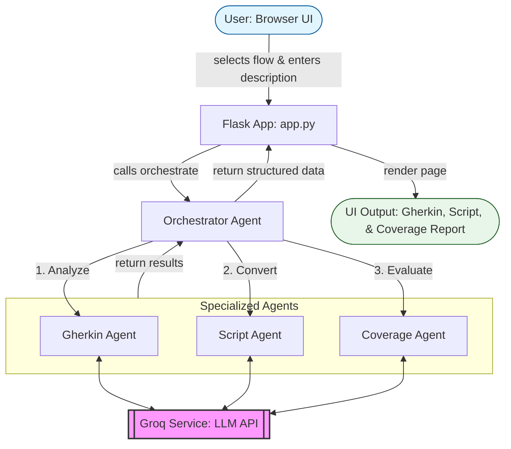

# System Architecture: AI Test Automation Assistant

## Overview
The AI Test Automation Assistant is a modular, multi-agent system designed to streamline the creation of high-quality test artifacts for the Parabank application. By leveraging the Groq (Llama 3.3) LLM and a specialized agent-based architecture, the system transforms natural language feature descriptions into executable, gap-aware test suites.

## System Design
The architecture follows a strictly decoupled design with specialized agents coordinated by a central orchestrator.

### Component Breakdown
1. **User Interface (Flask UI)**: A modern web interface where users select target application flows and input feature descriptions.
2. **Orchestrator Agent**: The central controller that manages the flow of data between sub-agents and ensures output consistency.
3. **Gherkin Agent**: Generates BDD-style scenarios, enforcing mandatory coverage of positive, negative, and edge cases.
4. **Script Agent**: Converts Gherkin scenarios into Playwright Python scripts with a strict 1:1 mapping and Edge browser support.
5. **Coverage Agent**: Analyzes the generated scenarios against requirements to identify missing flows and risk areas.
6. **LLM Service**: A reusable service layer for interacting with the Groq API (Llama 3.3), including fallback logic and response continuation.

## Technical Flow
The system processes user requests through the following pipeline:

1. **Input**: User selects a flow and enters a description in the UI.
2. **Handle**: Flask receives the request and triggers the **Orchestrator**.
3. **Generate Gherkin**: The Orchestrator calls the **Gherkin Agent** to build a balanced scenario suite.
4. **Generate Script**: The **Script Agent** transforms the Gherkin into executable Playwright code.
5. **Analyze Coverage**: The **Coverage Agent** reviews the suite for gaps and risks.
6. **AI Layer**: All agents utilize the **LLM Service** for interactions with the Groq model.
7. **Response**: Structured outputs are returned to the Flask UI for display.

## Architecture Diagram

> [!TIP]
> **Submission Note**: Export this diagram as a PNG or PDF to include in your final submission package for better visual clarity.
